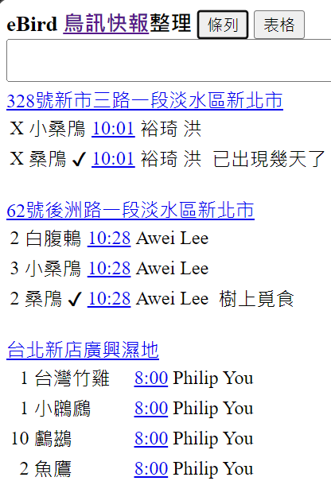
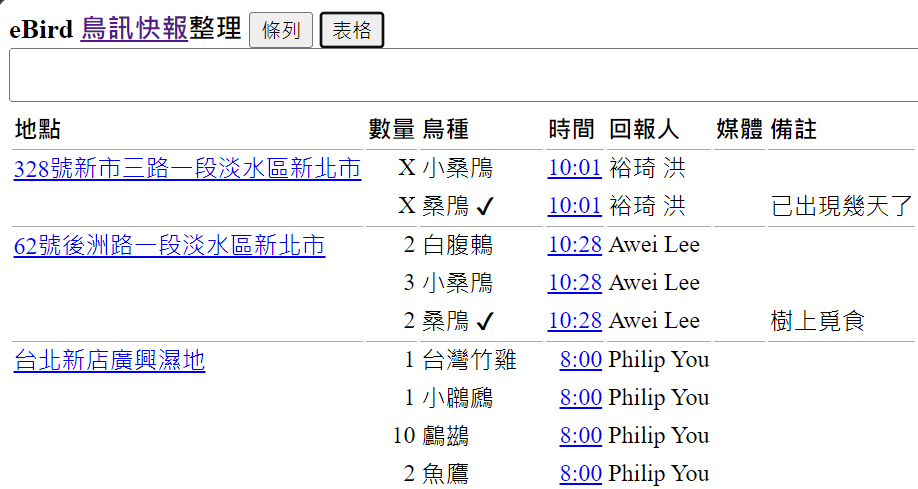

# eBird 工具

- [eBird 最近熱門地點](https://e-bird-christorngs-projects.vercel.app/recent-hotspots/)
- [鳥訊快報整理](https://e-bird-christorngs-projects.vercel.app/alerts/)
  
  因為訂閱 [eBird 鳥訊快報](https://ebird.org/alerts)，覺得純文字內容閱讀很吃力，故自己寫了 [eBird 鳥訊快報整理](https://e-bird-christorngs-projects.vercel.app/alerts/)網頁。它會將相同地點之項目群組起來，可輕易看到某地所有的鳥種項目。也把超連結加在地點及時間上，瀏覽時不會看到網址。另將地點及鳥名中外文部份皆刪除，僅留中文部份，看起來應該輕鬆多了。畫面很陽春，只是為了符合自己的需求，文字解析一定還有很多漏洞。希望對大家有一點幫助。

  
  

## 原始碼

[GitHub 原始碼](https://github.com/ChrisTorng/eBird) 
[回報問題](https://github.com/ChrisTorng/eBird/issues)

## 授權

本專案採用 MIT 授權條款。