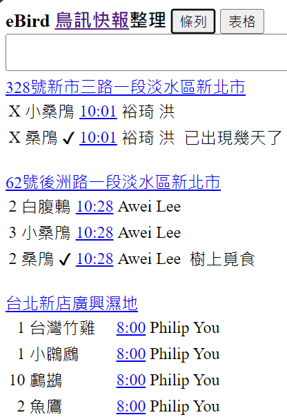
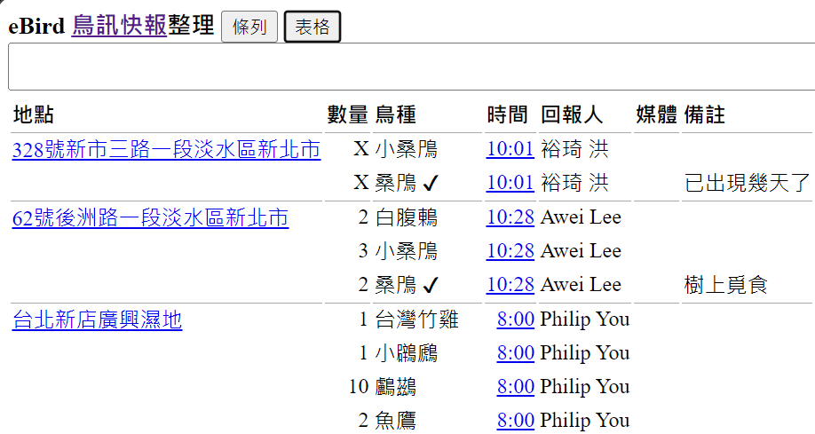

# eBird 工具

本專案保留 [鳥訊快報整理](alerts/)，可直接以靜態網站使用。

## 最近熱門地點已搬遷

- [新網站](https://christorng.idv.tw/eBirdRecentHotspot/)
- [獨立專案 eBirdRecentHotspot](https://github.com/ChrisTorng/eBirdRecentHotspot)

原 [recent-hotspots 入口](recent-hotspots/) 僅保留轉址，日期與地區參數會帶往新網站。
新專案使用 eBird API、每日 JSON 快照與 GitHub Pages。API 金鑰及開發方式請見新專案 README。
本 repo 已移除舊伺服器、爬蟲、相關測試、依賴與啟動腳本。

## [鳥訊快報整理](alerts/)
  
  因為訂閱 [eBird 鳥訊快報](https://ebird.org/alerts)，覺得純文字內容閱讀很吃力，故自己寫了 [eBird 鳥訊快報整理](alerts/)網頁。它會將相同地點之項目群組起來，可輕易看到某地所有的鳥種項目。也把超連結加在地點及時間上，瀏覽時不會看到網址。另將地點及鳥名中外文部份皆刪除，僅留中文部份，看起來應該輕鬆多了。

  
  

## 本機使用

直接開啟 `alerts/index.html`，或在本目錄執行：

```sh
python -m http.server 8000 --bind 127.0.0.1
```

瀏覽 `http://localhost:8000/alerts/`。無需安裝 Python 套件；也可使用任何靜態網頁伺服器。
部署時將本 repo 當靜態網站提供即可，舊服務 URL 是否繼續可用取決於原主機設定。

## 自動化測試

需要 Node.js 22 或更新版本，在 repo 根目錄執行：

```sh
npm test
```

測試不需要安裝額外套件。會自動找出 `alerts/samples*.txt` 的所有範例，逐筆比對固定的預期結果，確認鳥種、數量、時間、地點、網址、回報人、媒體與備註，以及貼上後的條列／表格顯示。涵蓋舊版繁體、新版簡體（臺北市與桃園市）、Markdown 連結、多行地址、不同換行格式，以及共同回報人合併。

新增或修改範例時，請同步人工檢查並更新 `tests/expected-alerts.json`；測試會檢查每份範例都有預期結果，避免漏測。GitHub Actions 會在每次 push 與 pull request 執行相同測試，也可手動執行。

## 原始碼

[GitHub 原始碼](https://github.com/ChrisTorng/eBird)<br/>
[回報問題](https://github.com/ChrisTorng/eBird/issues)

## [eBird Scripts](https://github.com/ChrisTorng/eBirdScripts)

另推薦 [eBird Scripts](https://github.com/ChrisTorng/eBirdScripts)，它是一個 [Tampermonkey](https://www.tampermonkey.net/) 使用者腳本，用於增強 [eBird](https://ebird.org/) 網站的功能，包括改用台灣格式日期，熱門鳥點中新增「最近鳥種」和「最近紀錄」連結。

## 授權

本專案採用 MIT 授權條款。
